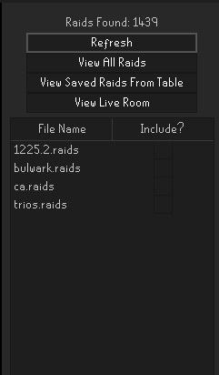
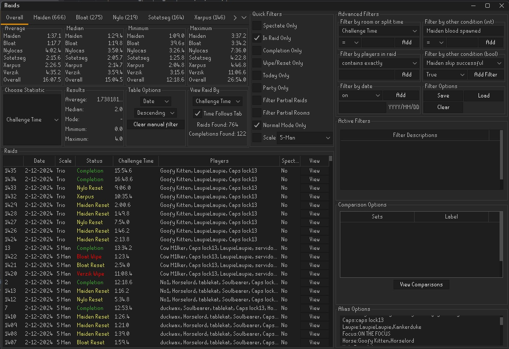
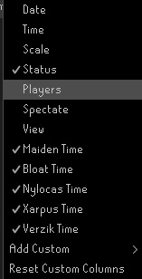
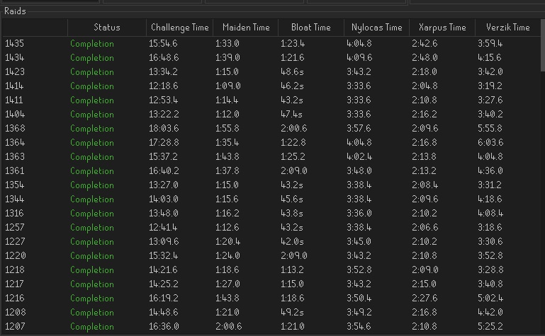
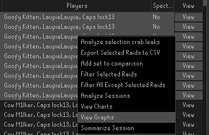
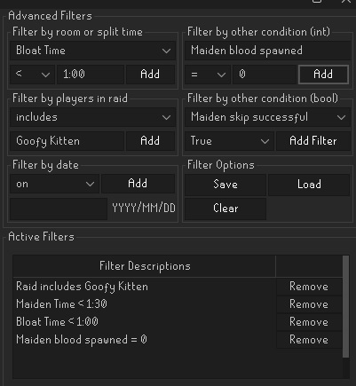
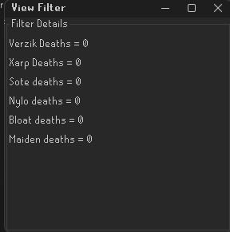
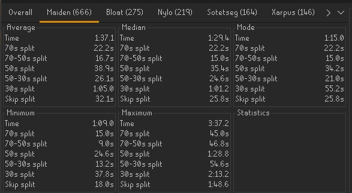

# Advanced Raid Tracker
This plugin tracks various advanced statistics and data about your theatre of blood runs.

## User Interface
### Side Bar

This panel will appear in the sidebar when you start the plugin. Once you've left a raid (spectate or not), you can hit refresh and then view all raids to see any raids added since the last refresh.

Pressing view all raids will open the main window of the plugin.

### Main Window

You can see per room statistics (average, median, minimum, maximum), as well as a table with all of your raids. 
You also have other options including advanced filters and comparisons which will be shown later.

You can change the column that is labeled 'challenge time' by default to any parameter you want by opening the 'view by raid' drop down:

You can sort the table by this value by selecting 'Value' instead of 'Date' in the table options panel

If you want to customize the data shown in the table you can right click the table header which will open this menu:

Where you can add whatever parameter to the table that you would like. You can then turn columns on and off, including the custom added ones, by right clicking again:

Which will allow the table to show as such:

Right clicking selected raids in the table will open a context menu:

### Analyze selection crab leaks

Once you've selected raids from the table and selected this option, you will be presented with a table showing the average crab leak per crab:

### Export Selected Raids to CSV

This option will open a window to save the raids you've selected under a different name.

These will appear in the table in the sidepanel of the plugin to be viewed later. Additionally, they will be saved in .runelite/advancedraidtracker/misc-dir/raids

### Add set to comparison

You can add multiple different selections to the comparison table, and give them labels describing what the selection is:

When you press view comparisons it will open a graph view with tabs named with the labels you gave the sets, which can be compared by almost any stat you want:

These graphs have the same parameter options as the view by in the main window:

### Filter Selected Raids

This will temporarily remove the selected raids from the table. You can remove this filter by clicking 'Clear manual filter' in the table options panel

### Filter all except selected raids

This will temporarily remove all but the selected raids from the table. You can remove this filter by clicking 'Clear manual filter' in the table options panel

### Analyze Sessions

This will go through all the selected raids, and sort them by scale and players in the raid, and automatically create and open the comparison view for every combination of scale+players it found. Example:

### View Charts

This will open a window with a chart of the selected raid, where you can see exactly what each player did on each tick of the boss fights. Hovering can give you additional info about what was targted by the player and the bosses HP at the time.
You can also see live charts as you raid by hitting "View Live Room" from the sidebar panel, however it will not show the red lines indicating boss-related actions until after the room has ended to avoid any chance of "revealing boss mechanics".

### View Graphs

This will open the graph comparison view of just the selected raids, with no label, as a quicker way of seeing it when you're not trying to compare different sets of data.

## Advanced Filters

In the main window of the plugin you have advanced filter options, these can be combined to control nearly anything about the selection shown in the table.

Adding filters will instantly filter data in the table. As you add them they will populate the table.

You can save a combination of filters by hitting 'save' in the filter options panel:

These filters are saved to .runelite/theatretracker/filters. You can view and load saved filter combinations with the 'load' button in filter options:

View filters will show you what is being filtered by that filter:

In the Load filters dialog, "Replace Active" will replace all currently active filters with the saved selection you load. "Add to Active" will add those filters on top of whatever is currently in the active filters table.

## Room Specific Splits

Each tab in the main window will show you all the room specific splits for that room, as well as change the 'challenge time' column in the table to display that room time.

